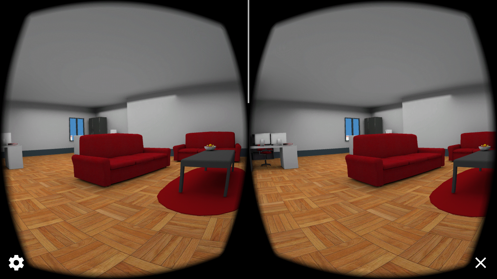

# Build an Apartment Starter Project

This project is part of [Udacity](https://www.udacity.com "Udacity - Be in demand")'s [VR Developer Nanodegree](https://www.udacity.com/course/vr-developer-nanodegree--nd017).

## Versions
- [Unity Patch 2017.2.0f3](https://unity3d.com/unity/qa/patch-releases?version=2017.2)
- [GVR Unity SDK v1.70.0](https://github.com/googlevr/gvr-unity-sdk/releases/tag/1.70.0)

### Notes

This project was built for Google Cardboard on Android and tested with a Samsung Galaxy S5 running API 19.

I chose to leave the lightmaps uncompressed for this project because
1) Most people don't care much for blocky, pixelated lighting
2) The project is small enough that the hardware can handle it
