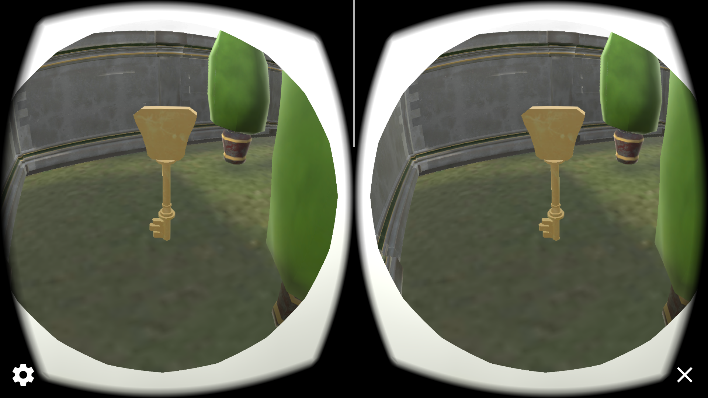
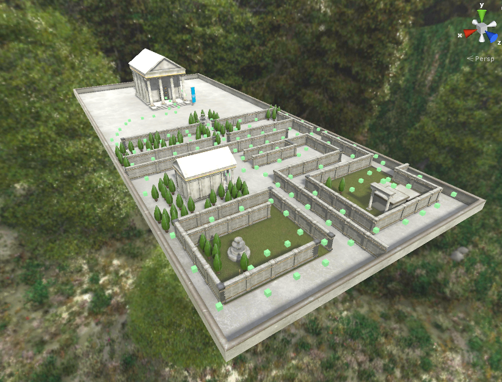

# A Maze Starter Project

This project is part of [Udacity](https://www.udacity.com "Udacity - Be in demand")'s [VR Developer Nanodegree](https://www.udacity.com/course/vr-developer-nanodegree--nd017).

### Screenshots

Found the key!

Editor view of the maze.

## Versions
- [Unity Patch 2017.2.0f3](https://unity3d.com/unity/qa/patch-releases?version=2017.2)
- [GVR Unity SDK v1.70.0](https://github.com/googlevr/gvr-unity-sdk/releases/tag/1.70.0)
